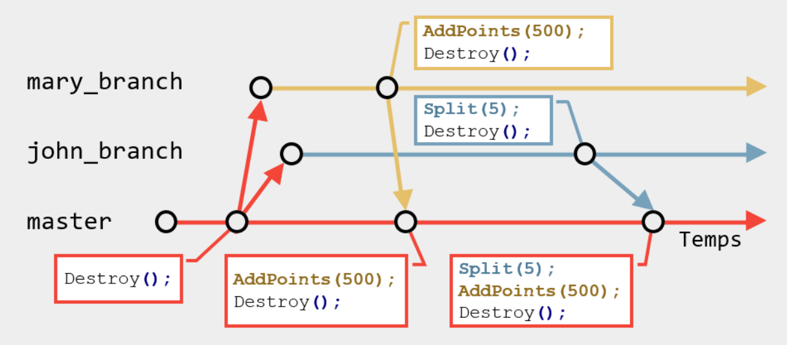
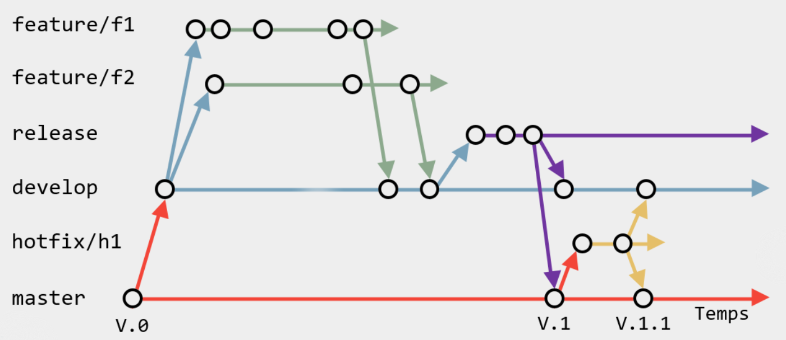
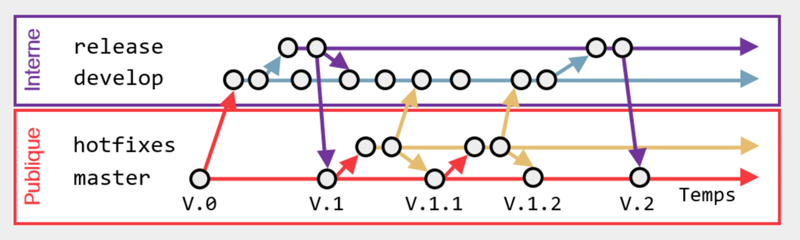
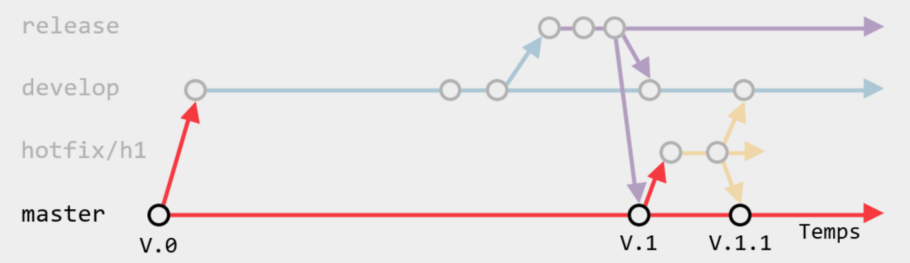
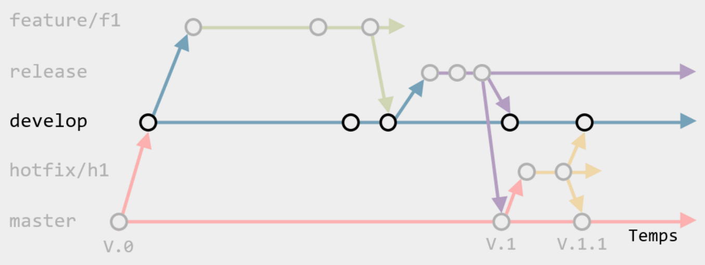
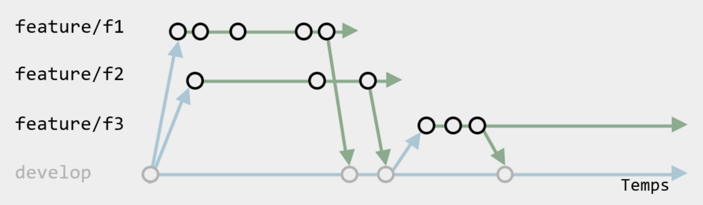
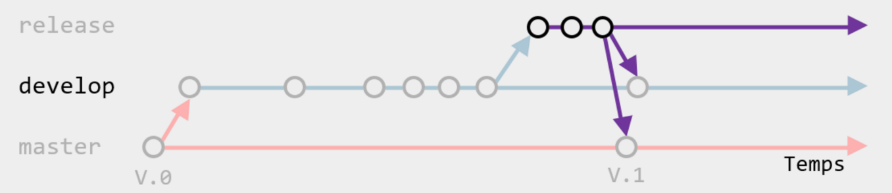
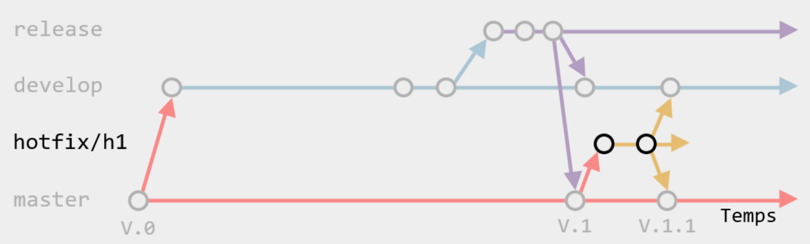

# Code de conduite

Dans l'intérêt de favoriser un environnement ouvert et accueillant, nous nous engageons, en tant que contributeurs 
et responsables de ce projet, à faire de la participation à notre projet une expérience agréable pour tous, quel 
que soit le niveau d'expérience. Nous comprenons que des erreurs peuvent survenir (pour diverses raisons telles que
le manque de sommeil ou une simple mauvaise journée) et nous engageons à maintenir un comportement professionnel 
à tout moment.

Exemples de comportements qui contribuent à créer un environnement positif :

* Être respectueux des différents points de vue et expériences
* Accepter la critique lorsqu'elle est constructive
* Toujours agir dans le meilleur intérêt du projet

Exemples de comportements non acceptables :

* L'utilisation d'un langage ou d'imagerie non professionnelle
* Trolling, commentaires insultants et attaques personnelles
* Tout autre comportement qui pourrait être considéré comme inapproprié dans un cadre professionnel

Tout contributeur au projet a le droit et la responsabilité de supprimer, modifier ou rejeter
tout commentaires, code, modifications du wiki, bogue et autres contributions qui ne respectent pas le code de 
conduite.

Ce code de conduite s'applique à la fois au sein des espaces du projet ainsi que dans les espaces publics 
(par exemple, une réunion *dans la vie réelle*). Ceci s'applique également lorsqu'un individu représente le projet. 
Font parties des exemples de représentation d'un projet le fait d'utiliser une adresse email propre au projet, de
poster sur les réseaux sociaux avec un compte officiel, ou d'intervenir comme représentant à un événement en-ligne 
ou hors-ligne. La représentation du projet pourra être autrement définie et clarifiée par les mainteneurs du
projet.

Les contributeurs qui ne respectent pas le code de conduite de bonne foi peuvent faire face temporairement ou définitivement
à des répercussions telles que l'expulsion du projet ou toute autre conséquence déterminée par les autres membres du projet.

# Devoirs des contributeurs

Tout contributeur doit respecter ces règles générales. C'est la responsabilité de tous afin de conserver un
environnement de travail agréable.

## Au sujet du dépôt Git

### Envoyer du code fonctionnel sur le dépôt

> Si un développeur envoie une nouvelle version sur le dépôt Git, il est de sa responsabilité de
s'assurer que le projet compile et est fonctionnel. Dans le cas contraire, il deviendra 
le `2 de Pique` du projet jusqu'à ce qu'un nouveau `2 de Pique` soit couronné.

Prenez note que chaque nouvelle version sur la branche `develop` déclanche un `build`. Si ce `build`
échoue, vous en serez notifié par courriel.

### Ne pas envoyer de fichiers temporaires sur le dépôt

> Si un développeur envoie une nouvelle version sur le dépôt Git, il est de sa responsabilité de
s'assurer que le projet ne contient pas de fichiers temporaires.

Par mesure de propreté, n'envoyez jamais de fichiers temporaires (tel que des builds) sur le dépôt.
En temps normal, le fichier `.gitignore` (à la racine du dépôt) devrait couvrir la liste de tous les
fichiers à ignorer. Cependant, ce n'est pas infaillible : prenez tout de même le temps de consulter 
la liste des fichiers ajoutés/modifiés à chaque révision.

### Créer des messages pertinents et lisibles

> Si un développeur envoie une nouvelle version sur le dépôt Git, il est de sa responsabilité
d'y ratacher un message pertinent et complet.

Pour des questions d'historique, faites des `commit messages` détaillant ce que contient la
révision. Nul besoin d'être très exhaustif : juste mentionner les changements en général.

En général, il est beaucoup plus facile de faire un bon `commit message` si le commit est petit.
Une bonne habitude à prendre est donc de faire des petites révisions.

Correct :thumbsup:

```
Added 'HealthPoints' to ennemies.
```

```
Removed deprecated `WorldManager` class in favor of `WorldStack`.
```

```
Fixed bug where the player would have been unable to move if they press jump while killing an ennemi.
```

Incorrect :thumbsdown:

```
Fixed stuff.
```

```
jhfksfsdfjkfsd
```

### Créer les changements dans des *Feature Branches*

> Si un développeur désire créer une fonctionalité, il est de sa responsabilité de la réaliser dans une branche à part.

Lorsque vous êtes prêt à réaliser un changement, créez une branche à partir de la dernière révision de la branche `develop`.
Le nom des branches doit suivre la nomenclature décrite ci-dessous.

| Type de changement | Préfix de la branche | Exemple                               |
| ------------------ | -------------------- | ------------------------------------- |
| Fonctionalité      | `feature`            | `feature/854-main-menu`               |
| Bogue non urgent   | `bug`                | `bug/421-cant-jump-off-ladder`        |
| Bogue urgent       | `hotfix`             | `hotfix/687-cant-win-tutorial-level`  |
| Corvée             | `chore`              | `chore/22-add-missing-tooltips`       |

Dès que vous avez terminé, fusionnez la branche `develop` dans la votre. Ensuite, faites une `Merge Request` pour la 
fusionner dans `develop`.

### Fusionner un changement que si deux autres programmeurs approuvent

> Si un développeur crée une `Merge Request`, il est de sa responsabilité d'attendre que deux
autres programmeurs l'approuve avant de la fusionner.

> Lorsqu'un développeur crée une `Merge Request`, il est de la responsabilité des autres développeurs
de la réviser.

Pour approuver ou refuser une `Merge Request`, utilisez les boutons :thumbsup: et :thumbsdown:. Il 
n'est pas possible de forcer cette règle, mais il est tout de même souhaité que tous les développeurs
la respectent.

## Au sujet de Unity

### Importer les *Assets* dans Unity

> Si un développeur ajoute un `Asset` dans le projet, il est de sa responsabilité d'ouvrir Unity au
moins une fois afin de générer les fichiers `.meta` **avant** de l'envoyer sur le dépôt Git.

La raison est simple : Unity utilie des `GUID` pour faire référence à un `Asset`. Les `GUID` sont
générés dès que Unity voit un nouveau fichier, ce qui produit un nouveau fichier `.meta`. Si un 
développeur ajoute un `Asset` et l'envoie sur le dépôt sans son `.meta`, plusieurs `GUID` différents
seront générés par les autres développeurs et des conflits incorrigeable surviendront. 

### Verouiller les scènes à modifier dans Unity

> Si un développeur veut modifier une scène, il est de sa responsabilité de notifier les autres 
développeurs via `Discord`.

Effectuer des fusion de scène est pratiquement impossible. Dans bien des cas, cela peut être corrigé
en utilisant des `Prefabs`, mais il peut arriver qu'il soit tout de même nécessaire de modifier une
scene.

## Au sujet du code

### Respecter le code des autres.

> Si un développeur désire apporter des changements à un bout de code développé activement par un autre, il est de
sa responsabilité d'en discuter avec les personnes concernés au lieu de faire ces changements sans préavis.

Petite nuance à apporter à cette règle : aucun bout de code n'appartient exclusivement à une personne et aucune 
*chasse gardée* ne sera tolérée. Par contre, lors de changements importants, il est préférable d'en discuter avec 
l'auteur initial ou avec le restant de l'équipe.

### Regénérer le code régulièrement

> Il est de la responsabilité des développeur de regénérer le code régulièrement.

Le projet contient un générateur de code, plus précisément de constantes diverses. Il contient,
entre autre, la liste des `Layers`, la liste des `Tags` et la liste des `GameObjects`. Un développeur
devrait donc regénérer ces constantes dans les situations suivantes :
 * Après chaque `Pull`.
 * Avant chaque `Push`.
 * Après avoir modifié les `Layers` ou les `Tags`.
 
Le script pour générer le code se nomme `GenerateCode.bat` et se trouve à la racine du projet. Il est
aussi possible d'exécuter ce script directement à partir du Unity.

# Normes de programmation

Tout programmeur doit respecter ces normes. C'est la responsabilité de tous afin de conserver du code
lisible et où il est plaisant de travailler.

## Nommage
Tout nom doit être suffisamment clair pour comprendre instantanément ce que cela représente (ou
contient). Ne pas utiliser d'abréviations sauf si l'abréviation est plus utilisée que la forme
longue (tel que *http*). Certaines abréviations sont tout de même acceptées, telles que :

 * `min` et `max` pour *minimum* et *maximum*.
 * `nb` pour *nombre de …*.
 * `db` pour *base de données*.

Nommage toujours en anglais (les commentaires peuvent être en français).

Toujours prioriser un bon nommage à l'écriture d'un commentaire.

### Variables, attributs et paramètres - *camelCasing*
Nommés en fonction de ce que contient la variable. 

Les lettres de l'alphabet (telles que `a`, `b` ou `c`) ne peuvent être utilisées que dans des calculs
mathématiques. Ce qu'elles représentent doit être documenté avec un commentaire. `i`, `j`, et `k` sont
réservés pour les itérateurs de boucle. `e` est réservé pour les exceptions dans les blocs 
*try/catch*. Aucun préfixe de type (tel que `int`, `str` ou `flt`). Aucun préfixe de genre non plus 
(tel que `p` ou `_` pour les paramètres et `m` ou `a` pour les attributs). Évitez les répétitions : ne
suffixez pas le nom d'une variable du nom de la classe le contenant. Aussi, évitez d'inclure le type 
dans le nom lorsqu'il peut être facilement deviné.

Correct :thumbsup:

```csharp
HighScore highScore = new HighScore();
Vector3 position = new Vector3(10,10,10);
int maxLifes = 15;
int healthPoints = 100;
```

```csharp
//Using the Law of Sines
//
//         a
//   B _________ C
//    \         /
//     \       /       a       b       c
//    c \     / b    ----- = ----- = -----
//       \   /       Sin A   Sin B   Sin C
//        \ /
//         V
//         A         where A,B,C are angles
//                   and a,b,c are lenghts
float A = 360f / 6f;
float a = 10;
float B = (180f - A) / 2f;
float b = (Sin(B) * A) / Sin(A);
```

Incorrect :thumbsdown:

```csharp
HighScore hs = new HighScore();
Vector2 positionVector2 = new Vector2(10,10);
bool boolshit = true;
int intMaxLifes = 15;
int mPlayerHeatlhPoints = 100;
```

```csharp
float v = d / t;
```

### Tableaux, listes et collections (Variables, attributs et paramètres)  - *camelCasing*
Nommés en fonction de ce que représente la collection d'éléments.

Ne pas suffixer de `list` ou de `array` : utiliser plutôt une forme au pluriel. Toujours utiliser les 
types abstraits (`IList` au lieu de `List`) pour faciliter la maintenance.

Correct :thumbsup:

```csharp
Student[] allStudents;
IList<Employee> partTimeEmployees;
```

```csharp
IList<int> scores = new List<int>();
```

Incorrect :thumbsdown:

```csharp
Student[] studentArray;
IList<Employee> employeeList;
```

```csharp
List<int> scores = new List<int>();
```

### Constantes et attributs statiques en lecture seule  - *PascalCasing*
Nommés en fonction de ce que représente la valeur de la constante. 

Attention à ne pas mélanger le standard Java (UPPER_CASE) avec le standard C# (PascalCase). Ne pas 
utiliser `static readonly` pour les types de base.

Correct :thumbsup:

```csharp
private const float MarginOfError = 0.001f;
private static readonly Guid Tag = new Guid("{612E-8U16- 3E}");
```

Incorrect :thumbsdown:

```csharp
private const float ERROR_MARGIN = 0.001f;
```

### Événements (Attributs événementiels publics) - *PascalCasing*
Nommés en utilisant une courte description de l'événement.

Toujours préfixé de `On`.

Correct :thumbsup:

```csharp
public event KeyEventHandler OnKeyPressed;
public event DeathEventHandler OnDeath;
```

Incorrect :thumbsdown:

```csharp
public event KeyEventHandler onKeyPressed;
public event DeathEventHandler DeathEvent;
```

### Classes, structures et énumérations - *PascalCasing*
Pour une classe, nommée en fonction de sa responsabilité ou de ce qu'elle représente. Contient 
généralement un verbe d'action. Pour une structure, nommée en fonction des données qu'elle 
représente. Pour une énumération, nommée en fonction de l'ensemble de valeurs qu'elle représente.

Ne jamais utiliser le terme `Manager`, car imprécis et souvent symptomatique d'un découpage déficient.
Aussi, n'utiliser aucun préfixe, même pour les classes abstraites.

Correct :thumbsup:

```csharp
public class ColisionSensor { }
public class HealthPoints { }
public abstract class BulletShooter { }
```

```csharp
public struct Point2D { }
```

```csharp
public enum Team { Red, Blue }
```

Incorrect :thumbsdown:

```csharp
public class ColisionManager { }
public abstract class BaseBulletShooter { }
```

### Interfaces - *PascalCasing*
Nommés en fonction de la capacité introduite par l'interface à toute classe l'implémentant.

Se terminent souvent par `able`, dont la signification réside dans l'anglais *being able to …*. Ne pas préfixer de `I`.

Correct :thumbsup:

```csharp
public interface GameEntity { }
public interface Damageable { }
```

Incorrect :thumbsdown:

```csharp
public interface GameEntity { }
public interface IDamageTaker { }
```

### Méthodes et fonctions - *PascalCasing*
Nommés en lien avec l'effet produit par un appel à cette méthode. 

Contient systématiquement un verbe d'action. Éviter l'usage de plusieurs verbes consécutifs afin de 
privilégier une forme courte. Les méthodes sont des messages envoyés aux objets. Leur nom doit 
refléter ce principe en utilisant des verbes à la forme impérative. 

Certaines méthodes existent pour avertir l'objet qu'un événement s'est produit. Exceptionnellement, 
ces méthodes débutent donc par le préfixe `On` suivi d'une courte description de l'événement.

Dans le cas d'un accesseur, privilégier les propriétés sauf si la donnée retournée doit être calculée 
chaque fois qu'elle est obtenue. Dans un tel cas, utiliser les préfixes `Get`, `Set` et `Is`.

Correct :thumbsup:

```csharp
public void Die() {}
public void OnNameChanged() { }
public string GetElapsedTimeSinceDeath (){ }
```

Incorrect :thumbsdown:

```csharp
public void MakeDie() {}
public void NameHasChanged() { }
public long GetName(){ }
```

### Propriétés - *PascalCasing*
Nommés en considération de l'information que contient la propriété. 

Privilégier un accesseur (méthode) à une propriété si la donnée retournée doit être calculée chaque 
fois qu'elle est obtenue. Évitez les répétitions : ne préfixez pas le nom d'une propriété du nom de 
la classe la contenant.

Correct :thumbsup:

```csharp
public string Name { get; set; }
public int HealthPoints { get; private set; }
```

Incorrect :thumbsdown:

```csharp
public string PlayerName { get; set; }
public int ElapsedTimeSinceDeath { get; }
```

### Variables et accesseurs booléens
Lorsque sémantiquement approprié, préfixer les variables, méthodes et propriétés booléennes de `Is`.
Aussi, préférez l'usage de deux méthodes opposées pour modifier un booléen au lieu d'utiliser une 
seule méthode, comme dans l'exemple ci-dessous.

Correct :thumbsup:

```csharp
private bool isEnabled = false;
public bool IsEnabled() { }
public void Enable() { }
public void Disable() { }
```

Critiqué :hand\_splayed: 

```csharp
public bool SetEnabled(bool isEnabled) { }
```

Incorrect :thumbsdown:

```csharp
private bool enabled = false;
public bool GetEnabled() { }
public bool SetIsEnabled(bool isEnabled) { }
```

### Delegates (et Delegates événementiels) - *PascalCasing*
Nommés en considération des retombées attendues par l'appel de la fonction déléguée.

Dans le cas d'un Delegate dédié à un événement, suffixer de `EventHandler`, mais ne pas préfixer de 
`On`.

Correct :thumbsup:

```csharp
public delegate bool ListFilter(int number);
public delegate void DeathEventHandler();
```

Incorrect :thumbsdown:

```csharp
public delegate bool FilterFunc(int number);
public delegate void OnDeath();
```

### Espaces de nommage - *Dot.Casing*
Nommés en fonction de la fonctionnalité gérée par les éléments de l'espace de nommage. 

Peut contenir un nom de produit. Ne contient jamais de verbe et n'est jamais au pluriel.

Correct :thumbsup:

```csharp
namespace Tp1.Game.Ai.State { }
```

Incorrect :thumbsdown:

```csharp
namespace Tp1.AiGameStates { }
```

## Visibilités

Les mots clés de visibilité tels que `public`, `private`, `protected` et `internal` doivent toujours
être présents, même si le langage les considère facultatifs.

Toujours utiliser la visibilité la plus restrictive possible.

**Enfin, il est strictement interdit d'avoir un attribut public.**

## Mise en forme
### Indentation, accolades « { » et « } » et longueur des lignes
Utilisez 4 espaces et non pas une tabulation pour indenter. Indentez d'un niveau à l'intérieur 
d'accolades `{` et `}`. Les accolades `{` et `}` sont toujours sur une nouvelle ligne. Vous pouvez 
ne pas utiliser d'accolades après une condition ou une boucle si l'instruction est très courte. Sinon,
toujours utiliser des accolades, même si le langage considère cela facultatif.

Une ligne de code ne doit jamais dépasser 160 caractères. Aussi, si possible, remplacez les condtions
produisant des booléens par des affectations.

Correct :thumbsup:

```csharp
if (healthPoints > 100)
{
    EnnemyFactory.create().isBoss(true).addBehaviour(new SplitBehaviour(40));
}
```

```csharp
if (healthPoints <= 0) isDead = true;
```

```csharp
if (OnDeath != null) OnDeath();
```

```csharp
isDead = healthPoints <= 0;
```

Incorrect :thumbsdown:

```csharp
if (healthPoints <= 0) {
    isDead = true;
}
```

```csharp
if (healthPoints <= 0) 
{
isDead = true;
}
```

```csharp
if (healthPoints > 100) EnnemyFactory.create().isBoss(true).addBehaviour(new SplitBehaviour(40));
```

```csharp
if (healthPoints <= 0)
isDead = true;
```

### Espacement vertical et regroupements (Retours de chariot)
Regroupez :
 * les variables/constantes/attributs fortement liées.
 * les lignes de code fortement liées.

Séparez chaque regroupement d'une ligne vide.

Correct :thumbsup:

```csharp
private Texture visual;
private float minSize;
private float maxSize;

private float minExplosionForce;
private float maxExplosionForce;
```

Incorrect :thumbsdown:

```csharp
private Texture visual;
private float maxSize;
private float minExplosionForce;
private float minSize;
private float maxExplosionForce;
```

### Nombre de classes, structure ou énumération par fichier
Une seule classe, structure ou énumération par fichier de code source. Le nom du fichier est égal au 
nom de la classe/structure/énumération qu'il contient. 

Exceptionnellement, toute énumération ou delegate possédant un lien très fort avec une classe peut 
se retrouver dans le même fichier.

### Ordre des éléments dans un fichier de code source
Les éléments à l'intérieur d'un fichier de code source doivent être placés dans cet ordre :

 1. Usings
 2. Espace de nommage
 3. Delegates
 4. Énumération / Structure / Classe

### Ordre des éléments dans une classes ou une structure
Les éléments à l'intérieur d'une classe ou d'une structure doivent être placés dans cet ordre :
 1. Constantes - *Public, suivi de privé*
 2. Attributs statiques - *Privé uniquement*
 3. Propriétés statiques - *Public, suivi de privé*
 4. Méthodes statiques - *Public et privé mélangé*
 7. Attributs - *Privé uniquement*
 6. Événements - *Public et protégé mélangé*
 7. Constructeur par défaut - *Public, privé ou protégé*
 8. Constructeurs avec paramètres - *Public, privé et protégé mélangé*
 9. Surcharges d'opérateurs - *Public, privé et protégé mélangé*
 10. Propriétés - *Public, privé et protégé mélangé*
 11. Méthodes - *Public, privé et protégé mélangé*
 12. Énumérations internes - *Public, suivi de privé et de protégé*
 13. Structures internes  - *Public, suivi de privé et de protégé*
 14. Classes internes  - *Public, suivi de privé et de protégé*

## Usage de commentaires et documentation
Les commentaires sont destinés à compenser le manque d'expressivité du langage, et non pas à 
reformuler le code en langage naturel. De tels commentaires sont comparables à de la duplication de 
code, ce qu'il faut pourtant éviter.

D'autres commentaires à éviter :
 * Les lignes de code en commentaire.
 * Les en-têtes de section de code (régions).

La maintenance des commentaires (et surtout de la documentation) est souvent laissée pour compte. Les
commentaires deviennent alors désuets, voir trompeurs. Mieux vaut laisser le code parler de lui-même
en utilisant un bon nommage et une bonne structure.

Avant d'écrire un commentaire, vérifiez s'il ne serait pas suffisant de :
 * Utiliser un meilleur nommage.
 * Redécouper le code en méthodes plus petites.
 * Redécouper la classe en classes plus petites.
 
Parmi les commentaires réellement utiles :
 * Explications sur un algorithme complexe.
 * Explications sur un calcul mathématique complexe.
 * Explications sur un Regex.
 * Documentation d'une librairie publique.
 * Commentaires légaux en haut des fichiers.

Correct :thumbsup:

```csharp
//Matches integers (like 1 or -12)
Regex integerRegex = new Regex("^-?\\d+$");
```

```csharp
/*
 * Copyright (c) Benjamin Lemelin
 * All rights reserved.
 */
```

Incorrect :thumbsdown:

```csharp
//Health points
private int healthPoints;
```

```csharp
/// <summary>
/// Default constructor.
/// </summary>
public HitSensor() { }
```

```csharp
/*************************************
* Get circle area
************************************/
int someLogicHere1 = 1;
/*************************************
* Add damage to enemies
************************************/
int someLogicHere2 = 2;
```

```csharp
private void OnEntityHit(int hitPoints)
{
//health.Hit(hitPoints);
}
```

# Règles architecturales

Tout programmeur doit respecter ces règles architecturales. C'est la responsabilité de tous afin de 
conserver du code lisible et où il est plaisant de travailler.

## Bonnes pratiques de programmation
### Single Responsability Principle (Classes)
Une classe ne doit posséder qu'une seule et unique responsabilité ou raison d'exister. Si une classe gère plus de 
deux choses, elle doit être séparée en plusieurs classes plus petites.

### Single Responsability Principle (Méthodes)
Une méthode (ou fonction) ne doit effectuer qu'une seule action. Elle ne peut donc pas, par exemple,
modifier les points de vie du joueur et mettre à jour l'affichage en même temps. Une méthode ne peut
pas non plus consommer (utiliser) et produire (retourner) des données en même temps.

### DIY - Do It Yourself!
La programmation orientée objet est basée sur le principe d'envoi de messages (via des appels de 
méthodes) entre les objets. En ce sens, un objet doit demander à un autre d'effectuer une action au
lieu d'effectuer cette action à sa place.

Un exemple fera certainement plus de sens :

Correct :thumbsup:

```csharp
int nbSheepsAlive = sheepfold.GetNbSheepAlive();
Debug.Log("We have " + nbSheepsAlive + " sheeps alive"); 
```

Incorrect :thumbsdown:

```csharp
int nbSheepsAlive = 0;
foreach (Sheep sheep in sheepfold.GetSheeps()) {
    if (sheep.HealthPoints > 0) {
        nbSheepsAlive++;
    }
}
Debug.Log("We have " + nbSheepsAlive + " sheeps alive"); 
```

### DRY – Don't Repeat Yourself
Évitez qu'une partie de code se retrouve à plusieurs endroits différents. Effectuez du découpage en 
méthodes, même si ce n'est que pour une seule ligne. 

### Usage du mot clé *readonly*
Tout attribut initialisé au sein d'un constructeur et qui n'est jamais modifié doit être `readonly`.

### Règle du Brave Petit Scout
Tout scout laisse le terrain plus propre que quand il est arrivé. Cette pratique est applicable en 
programmation. Lorsque vous ouvrez un fichier, même que pour seulement le lire, et qu'un renommage, 
l'ajout d'un commentaire ou une légère correction vous semble nécessaire, faites-le. À la longue, 
ces petites modifications rendent votre code plus agréable à travailler et toute l'équipe s'en porte 
mieux.

## Registre des *Bad smells*
### Un commentaire ne sent pas bon quand…
 * Il ne vous informe en rien sur le code.
 * Il n'est pas à jour.
 * Il est une simple description du code.
 * Vous n'en comprenez pas le sens.
 * C'est du code qui est commenté.

### Une classe ne sent pas bon quand…
 * Elle dépend directement de ses classes enfants.
 * Elle n'est pas instanciée nulle part.

### Une méthode ne sent pas bon quand…
 * Il y a trop de paramètres à lui envoyer.
 * Il y a un ou des paramètres de retour.
 * Il y a un ou des paramètres *drapeaux*.
 * Elle n'est pas utilisée.
 * Elle en fait plus que ce qu'elle dit (par son nom).
 * Elle fait plus qu'une seule chose.

### Le code ne sent pas bon quand…
 * Il se répète dans un ou plusieurs fichiers à la fois.
 * Il ne sert plus.
 * Une même action est faite de plusieurs façons différentes.
 * L'algorithme utilisé est incompréhensible.
 * Il contient des *goto* ou des *instanceof*.
 * Il n'y a pas de constantes.
 * Il contient de longues conditions.
 
# Feature Branches

Ce projet utilise les *feature branches* pour structurer le dépôt. Il est de la responsabilité des développeurs de respecter
et d'utiliser ce concept pour chaque ajout au dépôt. 

## Résumé

Les *feature branches* consistent à développer chaque nouvelle fonctionnalité dans une branche dédiée au lieu de la branche 
principale. Cette séparation permet à chaque développeur de travailler sur sa propre fonctionnalité sans perturber le travail
des autres. Cela signifie également que la branche principale ne contiendra jamais de code temporaire.



## Les numéros de version

Avant toute chose, il est important de comprendre les trois types de versions : 

 * les *versions majeures*
 * les *versions mineures*
 * les *révisions*

Les **versions majeures** sont des livrables importants, souvent causés par des changements architecturaux ou technologiques. Elles 
changement le premier chiffre dans le numéro de version. Par exemple : `1.0.0` et `2.0.0`.

Les **versions mineures** sont des livraisons de moindre importance, faisant usage de l'architecture actuelle pour ajouter des 
fonctionalitées. Elles changement le second chiffre dans le numéro de version. Par exemple : `1.0.0` et `1.1.0`.

Les **révisions** sont des corrections apportées à une version mineure. Elles visent à corriger des bogues importants au logiciel
livré. Elles changement le troisième chiffre dans le numéro de version. Par exemple : `1.1.1` et `1.1.2`.

## Les *feature branches* et le *GitFlow*

*GitFlow* est une idée introduite par [Vincent Driessen](http://nvie.com/posts/a-successful-git-branching-model/) comme une 
extension des *feature branches*.



En *GitFlow*, plusieurs branches avec un but bien précis sont prédéfinies. Ces branches compartimentent le développement et
prescrisent une séquence bien précise des événements.



Cette procédure est généralement appropriée pour tout développemnt de type *point-release* (livraisons à dates fixes) où deux
versions du logiciel doit être maintenues par les dévelopeurs : la version livrée (ou publique), où des *hotfix* doivent être 
faits pour corriger les bogues importants, et la version en cours de développement (ou interne), où les nouvelles 
fonctionalitées sont créées.

### La branche *Master*



La branche `master` contient la dernière version stable. Elle est est considérée comme *livrable* et aucun développement 
n'est fait directement dans cette branche. Chaque révision livrable est généralement étiquettée d'une numéro de version (tel
que `1.0.0`).

### La branche *Develop*



La branche `develop` contient la toute dernière version. Elle n'est pas suffisamment stable pour être livrable et aucun
développement de nouvelle fonctionalité n'est fait dans cette branche.

### Les branches _Feature/**_



Ces branches sont créées à partir de la branche `develop`. Il y a une branche pour fonctionalitée et lorsqu'une fonctionalité
est complétée, elle est fusionnée dans la branche `develop`.

### La branche *Release*



Lorsqu'un *milestone* est atteint, la branche `develop` est fusionnée dans la branche `release`. Cette branche est considérée 
*feature-complete* : aucune nouvelle fonctionalité n'y est ajouté, uniquement des corrections. Une fois stable, elle est 
fusionnée dans la branche `master` (pour y créer une version majeure ou mineure) ainsi que la branche `develop` (pour y 
reporter les corrections). 

### Les branches _*Hotfix/**_



Ces branches sont créées à partir de la branche `master`. Elles visent à corriger les bogues importants des versions 
ivrées. Elles sont fusionnée dans la branche `master` (pour y créer une révision) ainsi que la branche `develop` (pour
y reporter les corrections).